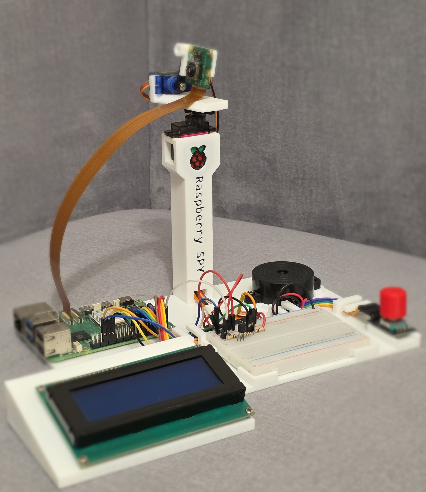
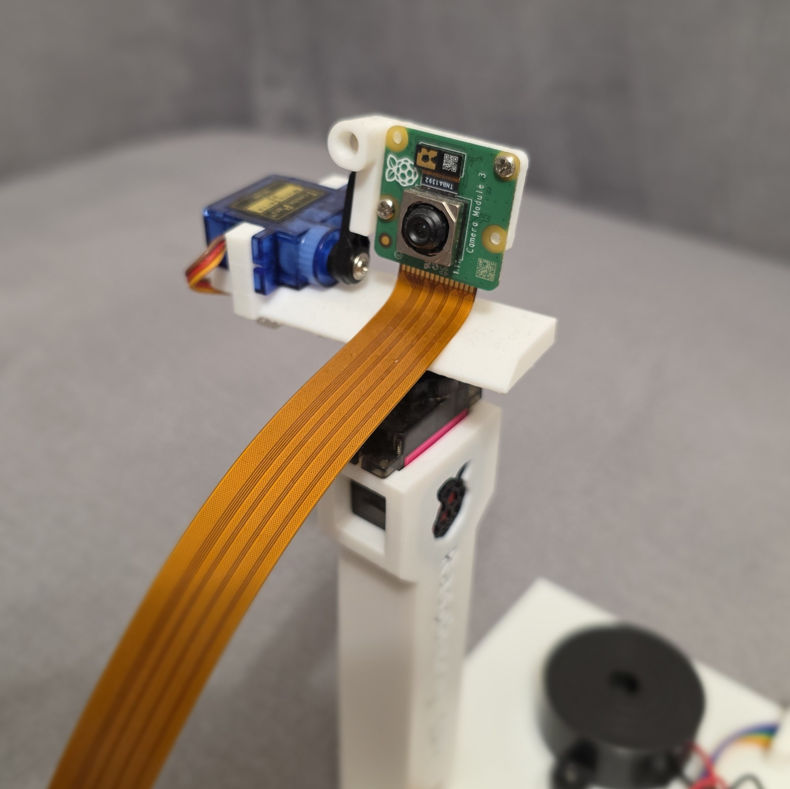
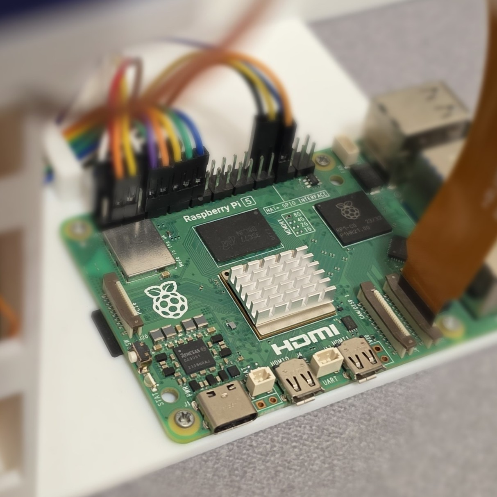
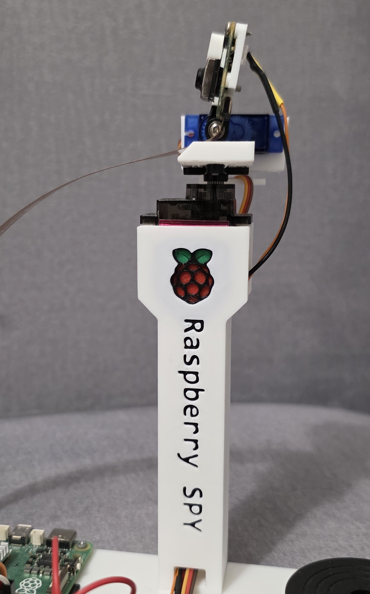
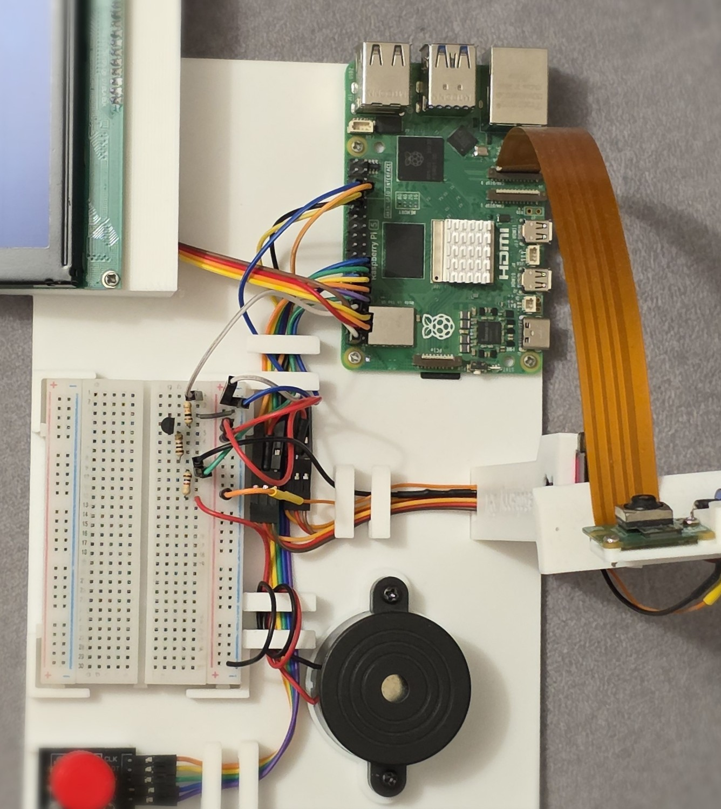

# The Raspberry SPY :eyes:

Hello! Welcome to my repository containing the Raspberry SPY app frontend - developed since I obtained my engineering degree in 2024. It was intended to work as a home monitoring system, but I added some other extra features

#### Current features :on:

- live camera stream
- camera viewing direction control
- adjustable camera backlight
- "local" interface built with 20x4 LCD display and rotary encoder
- programmable alarm clock built with a buzzer and 7 built-in melodies
- Ngrok tunneling. Website available at https://apt-dane-urgently.ngrok-free.app/

Page unavailable? Oops, I must have switched off my raspberry...

#### Components used

:computer: Raspberry Pi 5 module - 8GB RAM version

:camera: 12MPx Raspberry Pi Camera HD v3

:robot: SG90 and MG-90S micro servos

:symbols: 4x20 LCD display

:raised_back_of_hand: Rotary encoder

:speaker: Active buzzer

A custom-made 3D printed frame with a tall camera stand. See it in [Makerworld](https://makerworld.com/pl/models/2886103-the-raspberry-spy#profileId-3223978)

#### Software

:cd: Raspberry Pi OS

:snake: TypeScript + Angular. [Backend](https://github.com/Filip1159/The-Raspberry-SPY-backend) written in Python + Flask. As a Java developer I keep struggling with this language, but I find it really educational

:traffic_light: `gpiozero` python library for Raspberry Pi that handles raw GPIO communication

:video_camera: [MediaMTX](https://github.com/bluenviron/mediamtx) server that provides live camera stream via the HLS protocol

:satellite: [Nginx](https://nginx.org/) server configured as a reverse proxy

:earth_africa: [Ngrok](https://ngrok.com/) tunneling to expose the service publicly

### Gallery 

